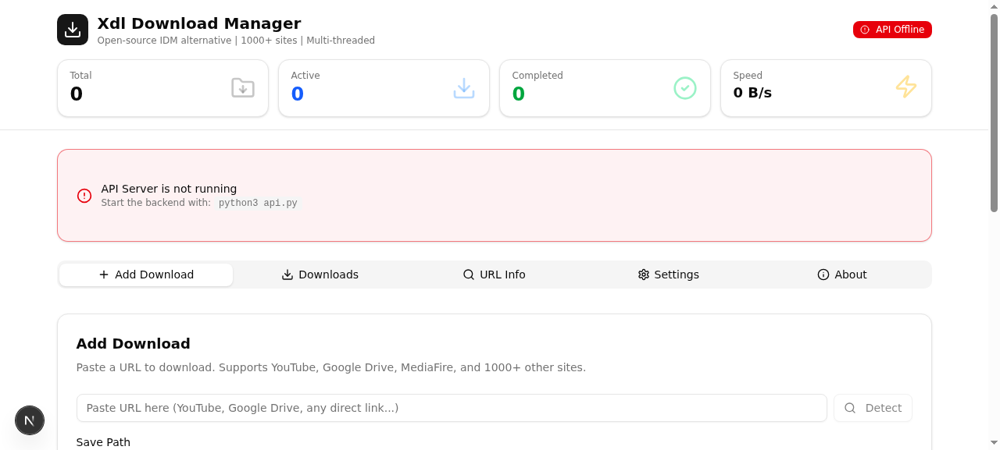
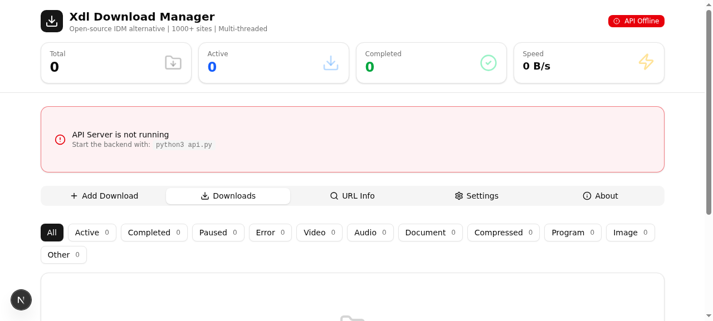
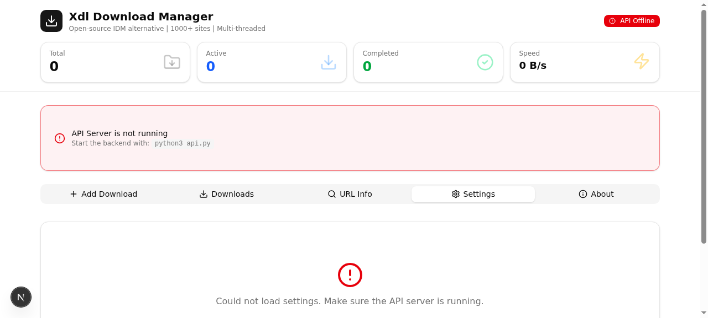
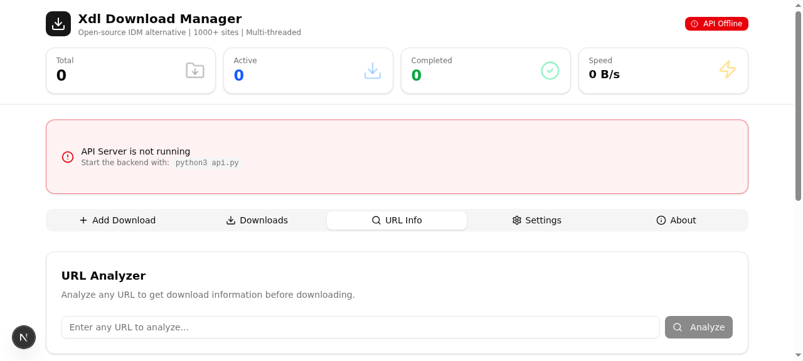
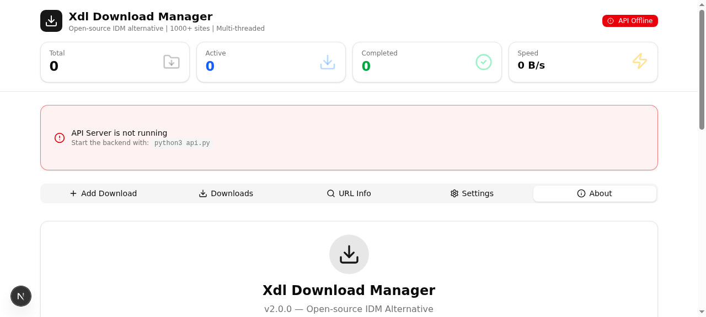

# Xdl Download Manager

**An open-source alternative to Internet Download Manager (IDM)** — built with Python, TypeScript, and Next.js.

Xdl is a powerful, feature-rich download manager that supports video/audio downloads from 1000+ sites, cloud storage services, and generic HTTP/HTTPS file downloads with multi-threaded segmented downloading, resume support, and a modern web interface deployable via ngrok.

---

## Features

### Multi-Threaded Downloads
- **Segmented downloading** — Split files into up to 32 segments for maximum download speed
- **Resume support** — Pause and resume downloads at any time, even after restarting the application
- **Smart file detection** — Automatically detects file size, name, and resume capability from server headers

### Video & Audio Downloads (1000+ Sites)
Powered by [yt-dlp](https://github.com/yt-dlp/yt-dlp), Xdl supports downloading from virtually any video/audio platform:

| Site | Video | Audio | Playlists |
|------|:-----:|:-----:|:---------:|
| YouTube | Yes | Yes | Yes |
| Vimeo | Yes | Yes | Yes |
| Dailymotion | Yes | Yes | Yes |
| TikTok | Yes | Yes | — |
| Twitter/X | Yes | Yes | — |
| Facebook | Yes | Yes | — |
| Instagram | Yes | Yes | — |
| Twitch | Yes | Yes | Yes |
| Reddit | Yes | Yes | — |
| SoundCloud | — | Yes | Yes |
| Bandcamp | — | Yes | Yes |
| Bilibili | Yes | Yes | Yes |
| Rumble | Yes | Yes | — |
| Odysee | Yes | Yes | Yes |
| 900+ more sites | Yes | Yes | varies |

**Video quality options:** Best, 720p, 480p, 360p, 240p

**Audio format options:** MP3, AAC, FLAC, Opus, WAV (with automatic FFmpeg conversion)

### Cloud Storage Downloads
| Service | Features |
|---------|----------|
| **Google Drive** | Direct download, file ID extraction, confirmation page handling, cookie support |
| **MediaFire** | Direct link extraction, progress tracking |
| **Pixeldrain** | API-based download, file info retrieval |
| **HuggingFace** | Model/dataset downloads, URL resolution |
| **Generic HTTP/HTTPS** | Any direct download link, HEAD-based file detection |

### TypeScript Web Interface (Primary UI)
The main web interface is built with **Next.js 16 + TypeScript + Tailwind CSS + shadcn/ui**, providing a modern, responsive download manager that works in any browser and can be deployed via ngrok for remote access:

- **Stats dashboard** — Real-time overview of total, active, completed downloads and speed
- **Add Download** — URL input with auto-detection, quality/format selection, segment control, and batch download support
- **Downloads list** — Filter by status or category, pause/resume/cancel/remove controls, progress bars with speed and ETA
- **URL Info** — Analyze any URL to see site, filename, size, and category before downloading
- **Settings** — Configure save path, concurrent downloads, segments, proxy, user-agent, and speed limit
- **About** — Feature overview and credits
- **Auto-refresh** — Downloads poll every 2 seconds for live progress updates
- **Ngrok ready** — Deploy with one command for public access

**Web UI Screenshots:**

| Add Download | Downloads | Settings |
|:---:|:---:|:---:|
|  |  |  |

| URL Info | About |
|:---:|:---:|
|  |  |

### Gradio Web Demo (Legacy)
A simpler Python-based web interface powered by **Gradio 6+**, useful as a lightweight alternative when Node.js is not available. Launch with `python3 gradio_demo.py`.

### Download Management
- **Queue system** — Priority-based download queue with concurrent download limiting (1-10 simultaneous)
- **Batch download** — Add multiple URLs at once from a text list
- **Scheduling** — Schedule downloads to start at a specific time
- **Clipboard monitoring** — Automatically detect URLs copied to the clipboard

### Settings & Configuration
- **General** — Default save path, max concurrent downloads, default segments, startup options
- **Connection** — Proxy server, custom User-Agent, timeout, retries, speed limit
- **Monitoring** — Clipboard monitoring toggle, auto-add URLs, check interval, file type filters
- **Categories** — Custom subfolder names for each file category

### CLI Mode
Use Xdl from the command line without any GUI:
```bash
python3 main.py --cli URL                 # Download with default settings
python3 main.py --cli URL -a              # Download as audio (MP3)
python3 main.py --cli URL -f mp3          # Download as MP3 audio
python3 main.py --cli URL -q 720p         # Download video in 720p
python3 main.py --cli URL -o /path/to     # Save to specific folder
python3 main.py --info URL                # Show URL information only
```

---

## Installation

### Prerequisites
- **Python 3.8+**
- **Node.js 18+** (for the TypeScript web UI)
- **FFmpeg** (required for audio extraction and video merging) — [Download](https://ffmpeg.org/download.html)

### Install Python Dependencies

```bash
pip install -r requirements.txt
```

Or install individually:
```bash
pip install PyQt5 yt-dlp requests beautifulsoup4 tqdm pyperclip lxml gradio fastapi uvicorn pyngrok
```

### Install Web UI Dependencies

```bash
cd web
npm install
# or
bun install
```

### Run

```bash
# TypeScript Web UI (Recommended)
# Terminal 1: Start the API backend
python3 api.py

# Terminal 2: Start the Next.js frontend
cd web
npm run dev

# Then open http://localhost:3000

# With ngrok for public access
python3 api.py --ngrok
python3 api.py --ngrok --ngrok-token YOUR_TOKEN

# Gradio Web Demo (Python-based)
python3 gradio_demo.py
python3 gradio_demo.py --share

# CLI Mode
python3 main.py --cli https://youtube.com/watch?v=dQw4w9WgXcQ

# PyQt5 Desktop GUI
python3 main.py

# Get URL info
python3 main.py --info https://youtube.com/watch?v=dQw4w9WgXcQ
```

---

## Project Structure

```
Xdl/
├── main.py                          # Entry point (PyQt5 GUI + CLI modes)
├── api.py                           # FastAPI backend (REST API + WebSocket)
├── gradio_demo.py                   # Gradio 6+ web demo (legacy)
├── requirements.txt                 # Python dependencies
├── setup.py                         # Package setup
├── LICENSE                          # Unlicense (Public Domain)
├── screenshots/                     # Web UI screenshots
│   ├── webui_add_download.png
│   ├── webui_downloads.png
│   ├── webui_settings.png
│   ├── webui_url_info.png
│   ├── webui_about.png
│   └── webui_full.png
│
├── web/                             # TypeScript Web UI (Next.js 16)
│   ├── package.json
│   ├── next.config.ts
│   ├── tailwind.config.ts
│   ├── tsconfig.json
│   ├── components.json
│   ├── src/
│   │   ├── app/
│   │   │   ├── page.tsx             # Main download manager page
│   │   │   ├── layout.tsx           # Root layout
│   │   │   └── globals.css          # Tailwind CSS styles
│   │   ├── lib/
│   │   │   ├── api.ts               # FastAPI client with types
│   │   │   └── use-downloads.ts     # React hook for real-time state
│   │   └── components/ui/           # shadcn/ui components (48 components)
│
└── xdl/
    ├── __init__.py                  # Package metadata
    │
    ├── core/                        # Core download engine
    │   ├── __init__.py
    │   ├── engine.py                # Multi-threaded segmented download engine
    │   ├── models.py                # Data models (DownloadItem, Status, Category)
    │   └── queue_manager.py         # Queue with scheduling & priority management
    │
    ├── downloaders/                 # Site-specific download handlers
    │   ├── __init__.py
    │   ├── base.py                  # Abstract base downloader class
    │   ├── youtube.py               # YouTube + 50+ video sites (via yt-dlp)
    │   ├── gdrive.py                # Google Drive downloader
    │   ├── mediafire.py             # MediaFire downloader
    │   ├── pixeldrain.py            # Pixeldrain downloader
    │   ├── huggingface.py           # HuggingFace model/dataset downloader
    │   ├── generic.py               # Generic HTTP/HTTPS fallback downloader
    │   └── router.py                # Auto site detection & downloader routing
    │
    ├── gui/                         # PyQt5 desktop GUI (legacy)
    │   ├── __init__.py
    │   ├── main_window.py           # IDM-like main window
    │   ├── add_download_dialog.py   # Add URL dialog with format/quality options
    │   ├── settings_dialog.py       # Settings dialog (4 tabs)
    │   └── about_dialog.py          # About dialog
    │
    └── utils/                       # Utility modules
        ├── __init__.py
        ├── clipboard_monitor.py     # Clipboard URL detection
        └── helpers.py               # Format helpers (size, speed, time, URL validation)
```

---

## API Reference

The FastAPI backend (`api.py`) provides a REST API and WebSocket for real-time updates:

### REST Endpoints

| Method | Endpoint | Description |
|--------|----------|-------------|
| GET | `/api/health` | Health check |
| GET | `/api/stats` | Download statistics |
| POST | `/api/downloads` | Add a new download |
| POST | `/api/downloads/batch` | Add multiple downloads |
| GET | `/api/downloads` | List all downloads |
| GET | `/api/downloads/{id}` | Get download details |
| POST | `/api/downloads/{id}/pause` | Pause a download |
| POST | `/api/downloads/{id}/resume` | Resume a download |
| POST | `/api/downloads/{id}/cancel` | Cancel a download |
| DELETE | `/api/downloads/{id}` | Remove a download |
| POST | `/api/detect` | Detect URL info |
| GET | `/api/settings` | Get settings |
| PUT | `/api/settings` | Update settings |
| GET | `/api/sites` | List supported sites |

### WebSocket

Connect to `ws://localhost:8000/ws` for real-time download updates (broadcast every 2 seconds).

Send `"refresh"` to request an immediate state update.

### Interactive API Docs

When the API server is running, visit:
- **Swagger UI**: `http://localhost:8000/docs`
- **ReDoc**: `http://localhost:8000/redoc`

---

## Ngrok Deployment

To expose your Xdl download manager to the internet using ngrok:

```bash
# Install ngrok Python package
pip install pyngrok

# Start API with ngrok tunnel
python3 api.py --ngrok

# With custom auth token
python3 api.py --ngrok --ngrok-token YOUR_NGROK_TOKEN
```

The ngrok tunnel creates a public URL that forwards to your local API server. Update the frontend's `API_BASE` in `web/src/lib/api.ts` to point to your ngrok URL for remote access.

---

## Usage Guide

### Adding a Download (Web UI)
1. Open the web UI at `http://localhost:3000`
2. Paste the URL into the "Download URL" field
3. Click **"Detect"** to auto-analyze the URL (site, filename, file size)
4. Choose download options:
   - **Save path** — Where to save the file
   - **Segments** — Number of download threads (1-32, more = faster for large files)
   - **Download type** — Video or Audio (for media sites)
   - **Video quality** — Best, 720p, 480p, 360p, 240p
   - **Audio format** — MP3, AAC, FLAC, Opus, WAV
5. Click **"Start Download"** to begin

### Managing Downloads (Web UI)
| Action | How |
|--------|-----|
| **Pause** | Click the pause button on the download row |
| **Resume** | Click the play button on a paused download |
| **Cancel** | Click the X button on an active download |
| **Remove** | Click the trash button on a non-active download |
| **Filter** | Use the filter buttons at the top of the Downloads tab |

### CLI Reference

```
usage: main.py [-h] [--cli URL] [--info URL] [-o OUTPUT] [-f FORMAT]
               [-q QUALITY] [-a] [--no-gui]

Xdl Download Manager - Open-source IDM Alternative

optional arguments:
  -h, --help            Show help message and exit
  --cli URL             Download URL from command line
  --info URL            Show URL information without downloading
  -o, --output OUTPUT   Output directory for downloaded file
  -f, --format FORMAT   Media format (mp3, aac, mp4, flac, opus, wav)
  -q, --quality QUALITY Video quality (best, 720p, 480p, 360p, 240p)
  -a, --audio           Download as audio (MP3)
  --no-gui              Force CLI mode (no GUI)
```

---

## Supported Sites (Full List)

### Video Platforms
YouTube, Vimeo, Dailymotion, Twitch, TikTok, Rumble, Odysee, BitChute, Brighteon, Bilibili, NicoNico, Streamable, LiveLeak, Veoh, Metacafe, Coub, and many more.

### Social Media
Twitter/X, Facebook, Instagram, Reddit, Tumblr, Pinterest, Snapchat, Periscope.

### Audio Platforms
SoundCloud, Bandcamp, Audiomack, Epidemic Sound, Art19, Podbean, Simplecast, Mixcloud.

### Educational
TED, Udemy, Skillshare, Coursera, Pluralsight, Panopto, Echo360.

### Anime/Streaming
Crunchyroll, Funimation.

### Cloud Storage
Google Drive, MediaFire, Pixeldrain, HuggingFace.

### Generic
Any direct HTTP/HTTPS download link (ZIP, EXE, ISO, PDF, etc.)

> **Note:** Full yt-dlp supported site list: [https://github.com/yt-dlp/yt-dlp/blob/master/supportedsites.md](https://github.com/yt-dlp/yt-dlp/blob/master/supportedsites.md)

---

## How It Works

### Segmented Downloading
When a server supports range requests, Xdl splits the file into multiple segments and downloads them simultaneously. Each segment runs in its own thread and writes to a temporary file. Once all segments complete, they are merged into the final output file. This can significantly increase download speeds, especially for large files on high-latency connections.

```
File (100 MB)
├── Segment 0: bytes 0-12.5 MB     ── Thread 0
├── Segment 1: bytes 12.5-25 MB    ── Thread 1
├── Segment 2: bytes 25-37.5 MB    ── Thread 2
├── Segment 3: bytes 37.5-50 MB    ── Thread 3
├── Segment 4: bytes 50-62.5 MB    ── Thread 4
├── Segment 5: bytes 62.5-75 MB    ── Thread 5
├── Segment 6: bytes 75-87.5 MB    ── Thread 6
└── Segment 7: bytes 87.5-100 MB   ── Thread 7
```

### Resume Support
If a download is paused or interrupted, Xdl records the last downloaded byte position. When resuming, it sends a `Range: bytes=N-` header to the server to continue from where it left off, avoiding re-downloading already completed data.

### Site Detection
The `DownloadRouter` automatically detects which site a URL belongs to by checking against known domain patterns. It then routes the download to the appropriate specialized downloader:

```
URL Input → DownloadRouter → Site Detection
  ├── youtube.com, vimeo.com, tiktok.com, etc.  → YouTubeDownloader (yt-dlp)
  ├── drive.google.com                           → GDriveDownloader
  ├── mediafire.com                              → MediaFireDownloader
  ├── pixeldrain.com                             → PixeldrainDownloader
  ├── huggingface.co                             → HuggingFaceDownloader
  └── any other http/https URL                   → GenericDownloader
```

### Category Auto-Detection
Files are automatically categorized based on their extension:

| Category | Extensions |
|----------|-----------|
| Video | mp4, mkv, avi, mov, wmv, flv, webm, m4v, mpg, mpeg, 3gp, ts, vob |
| Audio | mp3, wav, flac, aac, ogg, wma, m4a, opus, aiff, ape, alac |
| Document | pdf, doc, docx, xls, xlsx, ppt, pptx, txt, rtf, csv, epub |
| Compressed | zip, rar, 7z, tar, gz, bz2, xz, iso, dmg, deb, rpm |
| Program | exe, msi, apk, app, jar, bat, sh |
| Image | jpg, png, gif, bmp, svg, webp, ico, tiff, psd, heic |

---

## Configuration

Settings are stored in `~/.xdl/settings.json`:

```json
{
  "default_save_path": "/home/user/Downloads/Xdl",
  "max_concurrent": 3,
  "default_segments": 8,
  "start_on_boot": false,
  "show_tray_icon": true,
  "proxy": "",
  "user_agent": "",
  "connection_timeout": 60,
  "max_retries": 5,
  "speed_limit_kb": 0,
  "monitor_clipboard": true,
  "auto_add_urls": false,
  "clipboard_interval_ms": 1000,
  "monitor_video": true,
  "monitor_audio": true
}
```

### Proxy Configuration
Xdl supports HTTP, HTTPS, and SOCKS5 proxies:
```
http://proxy-server:port
https://proxy-server:port
socks5://proxy-server:port
```

Set the proxy in **Settings → Connection → Proxy Server**, or it will be applied to all downloaders automatically.

---

## Troubleshooting

### "Could not extract video info"
- Make sure yt-dlp is up to date: `pip install --upgrade yt-dlp`
- Some sites may require authentication cookies

### "Download speed is slow"
- Increase the number of segments in download options (up to 32)
- Check if a speed limit is set in Settings → Connection
- Try using a proxy if your ISP throttles downloads

### "Resume not working"
- The server must support range requests (`Accept-Ranges: bytes`)
- Some sites (especially video platforms) don't support resumable downloads
- For these sites, the download will restart from the beginning

### "FFmpeg not found" (audio extraction)
- Install FFmpeg and ensure it's in your system PATH
- Download from: [https://ffmpeg.org/download.html](https://ffmpeg.org/download.html)

### "API Offline" in web UI
- Make sure the FastAPI backend is running: `python3 api.py`
- The backend must be started before or alongside the Next.js frontend

---

## Contributing

1. Fork the repository
2. Create a feature branch: `git checkout -b feature/my-feature`
3. Commit your changes: `git commit -am 'Add new feature'`
4. Push the branch: `git push origin feature/my-feature`
5. Create a Pull Request

---

## License

This is free and unencumbered software released into the **public domain** under the [Unlicense](https://unlicense.org/).

Anyone is free to copy, modify, publish, use, compile, sell, or distribute this software, either in source code form or as a compiled binary, for any purpose, commercial or non-commercial.

---

## Credits

- **yt-dlp** — [https://github.com/yt-dlp/yt-dlp](https://github.com/yt-dlp/yt-dlp) (video/audio extraction engine)
- **FastAPI** — [https://fastapi.tiangolo.com](https://fastapi.tiangolo.com) (backend API framework)
- **Next.js** — [https://nextjs.org](https://nextjs.org) (TypeScript web frontend)
- **shadcn/ui** — [https://ui.shadcn.com](https://ui.shadcn.com) (UI component library)
- **Gradio 6** — [https://gradio.app](https://gradio.app) (Python web demo)
- **PyQt5** — [https://www.riverbankcomputing.com/software/pyqt/](https://www.riverbankcomputing.com/software/pyqt/) (desktop GUI)
- **requests** — [https://docs.python-requests.org/](https://docs.python-requests.org/) (HTTP library)
- **BeautifulSoup** — [https://www.crummy.com/software/BeautifulSoup/](https://www.crummy.com/software/BeautifulSoup/) (HTML parsing)

---

**Xdl Download Manager** — Fast. Powerful. Open Source.
